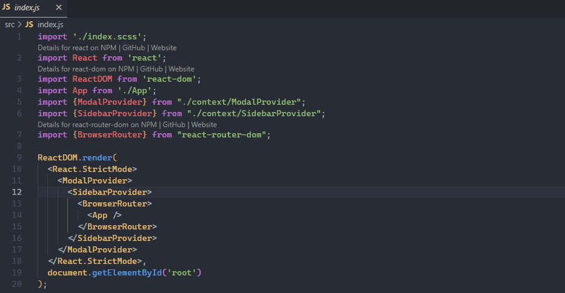

# NPM Info Lens

a Visual Studio Code extension that shows additional info for NPM packages directly in your source file

## Demo

## Features

- Support for React & TypeScript
- Link to NPM Registry
- Link to GitHub
- Link to website of the package
- Link  to Bundlephobia
- The link are always visible as CodeLens

## Release Notes

### 0.3.0

- Add Bundlephobia link for the packages

### 0.2.1

Public release of NPM Info Lens

---

**Enjoy!**
